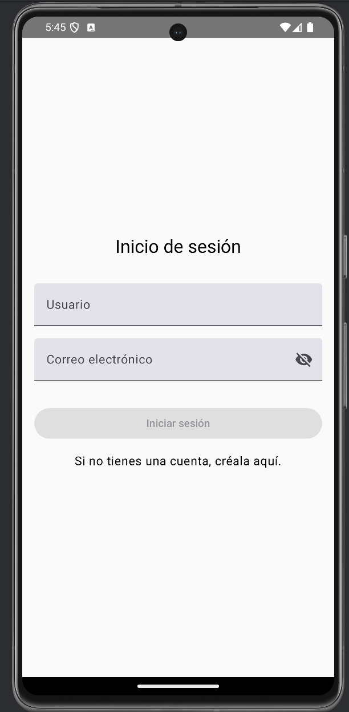

# UserApp

UserApp es una aplicación de Android desarrollada con Android Studio y Jetpack Compose como parte del proyecto "ProyectoFinalCompose". Su funcionalidad principal es gestionar el registro y acceso de usuarios, almacenando su nombre, correo electrónico, número de accesos y fecha del último acceso. Además, muestra mensajes periódicos con la hora actual y permite consultar datos desde una API pública utilizando Retrofit.

## Funcionalidades principales

1. **Gestión de usuarios con Room**:
   - Registro de usuarios con nombre y correo electrónico.
   - Seguimiento del número de accesos y la fecha del último acceso.

2. **Trabajador de hora personalizada**:
   - Muestra notificaciones periódicas con la hora actual mediante Toast.

3. **Consumo de API pública con Retrofit**:
   - Consulta datos desde una API pública, presentando información relevante en la interfaz.

4. **Soporte para múltiples idiomas**:
   - Configuración dinámica del idioma de la aplicación mediante `LocalizationManager`.

---

## Pasos para ejecutar el proyecto

1. **Clonar el repositorio**:
   ```bash
   git clone https://github.com/Shadieth/UserApp.git
   ```

2. **Abrir el proyecto**:
   - Importa el proyecto en Android Studio (versión recomendada: Koala 2024.1.2).

3. **Configurar dependencias**:
   - El proyecto utiliza `libs.version.toml` para gestionar dependencias. Asegúrate de sincronizar el proyecto con Gradle.

4. **Configurar el idioma (opcional)**:
   - Puedes cambiar el idioma en `MainActivity` modificando el valor de `languageCode`.

5. **Ejecutar la aplicación**:
   - Conecta un dispositivo o emulador Android y presiona `Run` en Android Studio.

---

## Decisiones de diseño

1. **Jetpack Compose**:
   - Decidí utilizar Jetpack Compose para aprovechar su diseño declarativo y su integración con las mejores prácticas modernas de Android. También me ha servido de práctica para estar actualizada con las últimas tecnologías.

2. **Room para persistencia**:
   - Se usó Room para facilitar la gestión de la base de datos, gracias a su integración con Kotlin y compatibilidad con consultas SQL. Además, es la más utilizada en el mundo android actualmente.

3. **Manejador de hilos (Handler)**:
   - Opté por usar un `Handler` para implementar el trabajador que muestra mensajes periódicos. Esto permite mantener un ciclo de vida sencillo.

4. **Retrofit para consumo de APIs**:
   - Retrofit fue elegido por su facilidad para manejar solicitudes HTTP y serializar datos JSON automáticamente.

5. **NavController para Navegación**:
   - Decidí utilizar `NavController` para gestionar la navegación dentro de la aplicación debido a su capacidad para manejar de manera eficiente las transiciones entre fragmentos y actividades. Además, `NavController` facilita la implementación de la navegación basada en acciones y destinos, lo que mejora la mantenibilidad y la claridad del flujo de navegación en la aplicación.

---

## Resumen de búsquedas realizadas

- **Implementación de Room**:
  - Investigaciones sobre cómo definir entidades, DAOs y construir la base de datos.

- **Manejo de hilos en Android**:
  - Exploración del uso de `Handler` y sus alternativas como WorkManager.

- **Retrofit y consumo de APIs**:
  - Configuración de Retrofit para llamadas API, manejo de errores y deserialización con Gson.

- **Soporte multilingüe**:
  - Métodos para cargar cadenas dinámicas de recursos y configuración de idiomas.

#### Principalmente, me guié por los códigos y resúmenes proporcionados por la profesora, así como por cursos en YouTube de MoureDev y AristiDevs. También utilicé herramientas de inteligencia artificial y realicé búsquedas en internet para complementar mi aprendizaje y resolver dudas específicas.
---
## Cambios Realizados

### 2025-01-23, 16:30
- **Cambio de lenguaje completado.** La app ahora soporta múltiples idiomas.

### 2025-01-22, 11:15
- **App casi terminada.** Faltan pequeños detalles, como la correcta configuración de la fecha en el formato adecuado.

### 2025-01-22, 10:21
- **Retrofit completado.** La integración con la API pública ahora está funcionando correctamente.

### 2025-01-20, 23:45
- **Room configurado y funcional.** La base de datos está operativa, aunque aún faltan optimizaciones en algunos detalles.

### 2025-01-13, 16:07
- **Interfaz de usuario de la pantalla de registro terminada.** El diseño y la funcionalidad de la pantalla de registro están completos.

### 2025-01-13, 11:59
- **LoginScreen UI finalizada.** La pantalla de inicio de sesión está lista y la app ya está adaptada para la traducción de idiomas.

### 2025-01-13, 10:38
- **Dependencias y navegación configuradas.** La configuración de dependencias y la navegación dentro de la app están listas.

---

## Organización del Proyecto

El proyecto sigue una estructura modularizada para facilitar su mantenimiento y escalabilidad:

### data
Gestión de la base de datos y el acceso a los datos.

- **Usuario**: Clase que representa al usuario.
- **UsuarioDAO.kt**: Interfaz para las operaciones de acceso a datos del usuario.
- **UsuarioDB.kt**: Clase para construir la instancia de la base de datos.
- **UsuarioRepositorio**: Clase que actúa como repositorio de datos del usuario.

### navigation
Configuración de la navegación en Compose.

- **AppNavigation.kt**: Clase para la navegación de la aplicación.
- **Navigation.kt**: Clase para la configuración de la navegación.

### retrofit
Configuración y uso de Retrofit para llamadas a la API.

- **ApiService**: Interfaz para definir los endpoints de la API.
- **RetrofitInstance**: Clase para crear la instancia de Retrofit.
- **User**: Clase que representa al usuario en las respuestas de la API.
- **UserViewModel**: Clase ViewModel para gestionar los datos del usuario.

### screens
Componentes y pantallas de la interfaz de usuario.

- **ApiResponse.kt**: Clase para manejar las respuestas de la API.
- **LoginScreen.kt**: Pantalla de inicio de sesión.
- **QueryApi.kt**: Clase para realizar consultas a la API.
- **RegisterScreen.kt**: Pantalla de registro.

### ui.theme
Elementos relacionados con la interfaz de usuario.

- **Color.kt**: Definición de colores.
- **Theme.kt**: Definición del tema de la aplicación.
- **Type.kt**: Definición de tipografías.

### viewmodel
Lógica de negocio e intermediarios entre data y ui.

- **LocalizationManager**: Clase para gestionar la localización.
- **MainActivity**: Actividad principal de la aplicación.
# Buenas Prácticas en la Organización del Proyecto

El proyecto sigue varias buenas prácticas que mejoran su mantenibilidad y escalabilidad:

## 1. Arquitectura Modularizada
   La separación en módulos como `data`, `retrofit`, `screens`, `viewmodel`, y `navigation` permite un código organizado y facilita la modificación sin afectar al resto de la app.

## 2. Uso de ViewModels
   Los **ViewModels** gestionan la lógica de negocio y los datos, desacoplando la UI de la lógica, lo que mejora la gestionabilidad y evita fugas de memoria.

## 3. Repositorio para Gestión de Datos
   El uso de un **repositorio** para la gestión de datos (en `UsuarioRepositorio`) permite abstraer el acceso a los datos y proporciona una API limpia para la UI.

## 4. Retrofit para Comunicación con APIs
   La configuración de **Retrofit** en un módulo separado centraliza la interacción con las APIs, mejorando la mantenibilidad y facilitando futuras modificaciones.

## 5. Manejo de Localización
   El **LocalizationManager** gestiona la localización, facilitando la adaptación de la app a diferentes idiomas y regiones.

## 6. Navegación en Compose
   La navegación está configurada en un módulo separado (`navigation`), lo que centraliza la lógica de navegación y facilita su mantenimiento.

## 7. UI Desacoplada y Modularizada
   La UI está dividida en pantallas reutilizables, lo que mejora la legibilidad del código y facilita las pruebas de cada componente.

## 8. Estructura de Carpetas Claras
   La estructura de carpetas (como `data`, `navigation`, `screens`, `viewmodel`, `ui.theme`) facilita la navegación en el proyecto y mantiene una organización coherente.

## 9. Clases de Respuesta de la API
   La clase **ApiResponse** maneja las respuestas de la API de manera centralizada, evitando la repetición de código en toda la app.
---
# Pantallas de la App

## Inicio de Sesión


## Crear Cuenta


## Consultar API


## Respuesta de la API

